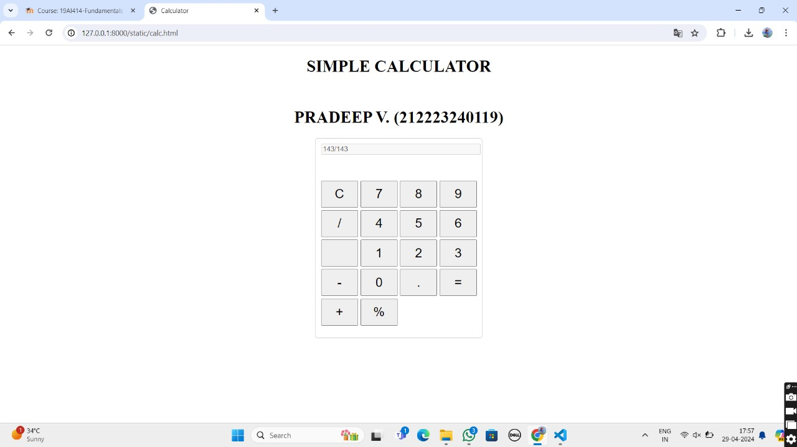
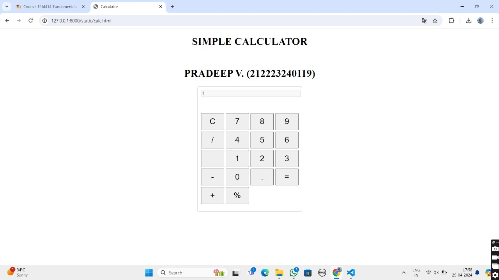

# Ex.08 Design of a Standard Calculator
## Date:29.04.2024

## AIM:
To design a web application for a standard calculator with minimum five operations.

## DESIGN STEPS:

### Step 1:
Clone the github repository and create Django admin interface.

### Step 2:
Change settings.py file to allow request from all hosts.

### Step 3:
Use CSS for creating attractive colors.

### Step 4:
Write JavaScript program for implementing five different operations.

### Step 5:
Validate the HTML and CSS code.

### Step 6:
Publish the website in the given URL.

## PROGRAM :
```
<!DOCTYPE html>
<html lang="en">
<head>
    <meta charset="UTF-8">
    <meta name="viewport" content="width=device-width, initial-scale=1.0">
    <title>Calculator</title>
    <link rel="stylesheet" href="calc.css">
</head>
<body>
    <h1 align="center">SIMPLE CALCULATOR</h1>
    <br>
    <h1 align="center">SARANYA S. (212223220101)</h1>
    <div class="calculator">
        <input type="text" id="display" disabled>
        <div class="keys">
            <button onclick="clearDisplay()">C</button>
            <button onclick="appendToDisplay('7')">7</button>
            <button onclick="appendToDisplay('8')">8</button>
            <button onclick="appendToDisplay('9')">9</button>
            <button onclick="appendToDisplay('/')">/</button>
            <button onclick="appendToDisplay('4')">4</button>
            <button onclick="appendToDisplay('5')">5</button>
            <button onclick="appendToDisplay('6')">6</button>
            <button onclick="appendToDisplay('')"></button>
            <button onclick="appendToDisplay('1')">1</button>
            <button onclick="appendToDisplay('2')">2</button>
            <button onclick="appendToDisplay('3')">3</button>
            <button onclick="appendToDisplay('-')">-</button>
            <button onclick="appendToDisplay('0')">0</button>
            <button onclick="appendToDisplay('.')">.</button>
            <button onclick="calculate()">=</button>
            <button onclick="appendToDisplay('+')">+</button>
            <button onclick="appendToDisplay('%')">%</button>
        </div>
    </div>
    <script src="calc.js"></script>
</body>
</html>

.calculator {
  width:300px;
  height: 50vh;
  margin: 0 auto;
  border: 0.5px solid #ccc;
  border-radius: 5px;
  padding: 10px;
  text-align: center;
}
#display {
  width: 100%;
  max-height: 380ch;
  margin-bottom: 50px;
}

.keys {
  display: grid;
  grid-template-columns: repeat(4, 1fr);
  gap: 5px;
}

button {
  padding: 10px;
  font-size: 25px;
}
body {
  background-image: url('image.png'); 
  background-size: cover;
  background-position: center;
  background-repeat: no-repeat;


  let display = document.getElementById('display');

function appendToDisplay(value) {
    display.value += value;
}

function clearDisplay() {
    display.value = '';
}

function calculate() {
    try {
        display.value = evalExpression(display.value);
    } catch(error) {
        display.value = 'Error';
    }
}

function evalExpression(expression) {
    return Function('"use strict";return (' + expression + ')')();
}
}


```

## OUTPUT:


## RESULT:
The program for designing a standard calculator using HTML and CSS is executed successfully.
